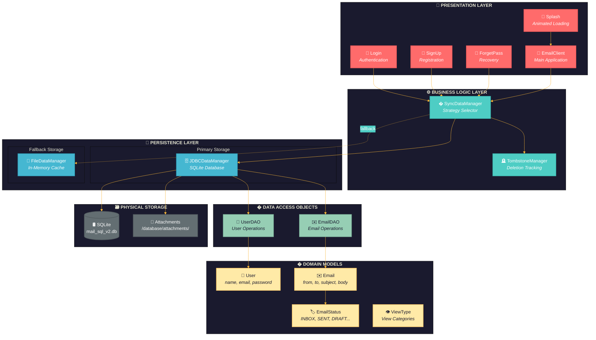

<p align="center">
  
</p>

<h1 align="center">📧 Mail.CM v2</h1>

<p align="center">
  <b>A Modern GUI-Based Email Client Simulation</b><br/>
  <i>Built with Java Swing • SQLite Database • DAO Design Pattern</i>
</p>

<p align="center">
  
  
  
  
</p>

---

## 🌟 Overview

**Mail.CM** is a feature-rich desktop email client simulation developed as a GUVI project. It provides a complete email experience with a beautiful modern UI, multi-user support, and robust data management using both JDBC and file-based storage systems.

---

## ✨ Features

| Feature                   | Description                             |
| ------------------------- | --------------------------------------- |
| 📝 **Compose**            | Create and send emails with attachments |
| 📥 **Inbox**              | View and manage received emails         |
| 📤 **Sent**               | Track all sent emails                   |
| 📁 **Archive**            | Archive important emails                |
| 🗑️ **Trash**              | Safely delete and recover emails        |
| 👥 **Multi-User**         | Run multiple instances simultaneously   |
| 🗄️ **JDBC Storage**       | SQLite database integration             |
| 📄 **File Storage**       | Fallback file-based data management     |
| 🔐 **Password Reset**     | Secure password recovery system         |
| ⚙️ **Account Management** | Full account deletion support           |

---

## 🚀 Quick Start

### 📦 Recommended Method

1. Download the latest release ZIP file
2. Extract to your desired location
3. Run `start.bat`

### 💻 Development Setup

```bash
# Clone the repository
git clone https://github.com/Aakarsh-192/Mail.CM-v2.git

# Navigate to the project directory
cd Mail.CM-v2

# Create output directory
mkdir classes

# Compile Java files
javac -cp ".;sqlite-jdbc-3.51.0.0.jar" -d classes *.java

# Run the application
java -cp "classes;sqlite-jdbc-3.51.0.0.jar" EmailClient
```

> 💡 **Tip:** Use `start.bat` for auto-compilation and execution!

---

## 🧪 Test Accounts

Pre-configured accounts for testing:

| Email        | Password |
| ------------ | -------- |
| `t1@mail.cm` | `000000` |
| `t2@mail.cm` | `000000` |
| `t3@mail.cm` | `000000` |

---

## 📁 Project Structure

```
Mail.CM-v2/
├── 📄 Core Application
│   ├── EmailClient.java      # Main application entry point
│   ├── Splash.java           # Animated splash screen
│   ├── Login.java            # User authentication UI
│   ├── SignUp.java           # Account registration UI
│   └── ForgetPass.java       # Password recovery UI
│
├── 📊 Data Models
│   ├── Email.java            # Email entity model
│   ├── User.java             # User entity model
│   ├── EmailStatus.java      # Email status enum
│   └── ViewType.java         # Mailbox view types enum
│
├── 🗄️ Data Access Layer (DAO)
│   ├── EmailDAO.java         # Email DAO interface
│   ├── EmailDAOImpl.java     # Email DAO implementation
│   ├── UserDAO.java          # User DAO interface
│   └── UserDAOImpl.java      # User DAO implementation
│
├── 💾 Data Managers
│   ├── IDataManager.java     # Data manager interface
│   ├── JDBCDataManager.java  # SQLite database manager
│   ├── FileDataManager.java  # File-based storage manager
│   ├── SyncDataManager.java  # Storage strategy selector
│   └── TombstoneManager.java # Deletion tracking manager
│
├── 📦 Resources
│   ├── CMlogo.png            # Application logo
│   ├── sqlite-jdbc-3.51.0.0.jar  # SQLite JDBC driver
│   └── start.bat             # Windows startup script
│
└── 📂 database/              # SQLite database files
```

---

## 📜 File Descriptions

### 🎯 Core Application Files

| File               | Description                                                                                                                                                                                                                                                            |
| ------------------ | ---------------------------------------------------------------------------------------------------------------------------------------------------------------------------------------------------------------------------------------------------------------------- |
| `EmailClient.java` | **Main Application Class** - Entry point of the application. Contains the `MailboxPanel` with full email management UI including compose, inbox, sent, archive, and trash views. Features modern glassmorphic design with animated gradients and custom UI components. |
| `Splash.java`      | **Splash Screen** - Animated loading screen with gradient background animation, progress bar, and logo display. Shows during application startup for 3 seconds.                                                                                                        |
| `Login.java`       | **Login Panel** - Two-step authentication UI with email verification and password entry. Features modern glassmorphic cards, animated gradient backgrounds, and smooth transitions.                                                                                    |
| `SignUp.java`      | **Registration Panel** - Three-step signup wizard for new users. Includes name entry, email ID selection with availability checking and suggestions, and password creation with validation.                                                                            |
| `ForgetPass.java`  | **Password Recovery** - Two-step password reset flow. Allows users to find their account and set a new password securely.                                                                                                                                              |

---

### 📊 Data Model Files

| File               | Description                                                                                                                                                                                                                        |
| ------------------ | ---------------------------------------------------------------------------------------------------------------------------------------------------------------------------------------------------------------------------------- |
| `Email.java`       | **Email Entity** - Represents an email message with properties: `messageId`, `from`, `to` (list), `subject`, `body`, `attachmentPaths`, `timestamp`, `isRead`, `status`, and `lastUpdated`. Implements `Serializable` for storage. |
| `User.java`        | **User Entity** - Represents a user account with properties: `name`, `emailId`, `passwordHash`, and `lastModified`. Implements `Serializable` for persistence.                                                                     |
| `EmailStatus.java` | **Email Status Enum** - Defines email states: `INBOX`, `SENT`, `DRAFT`, `ARCHIVED`, `DELETED`.                                                                                                                                     |
| `ViewType.java`    | **View Type Enum** - Defines mailbox view types: `INBOX`, `SENT`, `DRAFTS`, `ARCHIVE`, `DELETED`.                                                                                                                                  |

---

### 🗄️ DAO Layer Files

| File                | Description                                                                                                                                                                                      |
| ------------------- | ------------------------------------------------------------------------------------------------------------------------------------------------------------------------------------------------ |
| `EmailDAO.java`     | **Email DAO Interface** - Defines methods for email CRUD operations: `findAll()`, `findById()`, `findByRecipient()`, `findBySender()`, `insert()`, `update()`, `delete()`, and `insertAtomic()`. |
| `EmailDAOImpl.java` | **Email DAO Implementation** - SQLite implementation of `EmailDAO`. Handles database queries for emails including atomic transactions for send operations.                                       |
| `UserDAO.java`      | **User DAO Interface** - Defines methods for user management: `findAll()`, `findByEmail()`, `findByUsername()`, `insert()`, `update()`, `delete()`.                                              |
| `UserDAOImpl.java`  | **User DAO Implementation** - SQLite implementation of `UserDAO`. Manages user account persistence with prepared statements.                                                                     |

---

### 💾 Data Manager Files

| File                    | Description                                                                                                                                                                                    |
| ----------------------- | ---------------------------------------------------------------------------------------------------------------------------------------------------------------------------------------------- |
| `IDataManager.java`     | **Data Manager Interface** - Abstract interface defining all data operations: user/email CRUD, attachment handling, data reload, and save methods.                                             |
| `JDBCDataManager.java`  | **JDBC Data Manager** - Primary storage implementation using SQLite. Creates and manages database tables, coordinates DAO operations, and handles file attachments in `database/attachments/`. |
| `FileDataManager.java`  | **File Data Manager** - Fallback storage using in-memory lists. Used when SQLite is unavailable. Does not persist data between sessions.                                                       |
| `SyncDataManager.java`  | **Sync Data Manager** - Storage strategy selector. Attempts to use `JDBCDataManager`, falls back to `FileDataManager` on failure. Acts as a facade for storage operations.                     |
| `TombstoneManager.java` | **Tombstone Manager** - Tracks deleted users and emails for synchronization purposes. Maintains deletion logs in `database/sync_meta/` directory.                                              |

---

### 📦 Resource Files

| File                       | Description                                                                              |
| -------------------------- | ---------------------------------------------------------------------------------------- |
| `CMlogo.png`               | Application logo (56KB) - Displayed in splash screen and can be used in UI headers.      |
| `sqlite-jdbc-3.51.0.0.jar` | SQLite JDBC driver (14MB) - Required dependency for database operations.                 |
| `start.bat`                | Windows startup script - Automatically compiles Java files and launches the application. |

---

## 🏗️ Architecture



### 📐 Layer Responsibilities

| Layer                 | Components                                     | Responsibility                          |
| --------------------- | ---------------------------------------------- | --------------------------------------- |
| 🎨 **Presentation**   | Splash, Login, SignUp, ForgetPass, EmailClient | User interface and interaction handling |
| ⚙️ **Business Logic** | SyncDataManager, TombstoneManager              | Storage strategy, deletion tracking     |
| 💾 **Persistence**    | JDBCDataManager, FileDataManager               | Data storage implementations            |
| 🔌 **DAO**            | UserDAO, EmailDAO                              | Database CRUD operations                |
| 📦 **Domain**         | User, Email, EmailStatus, ViewType             | Core data models                        |
| 🗃️ **Storage**        | SQLite DB, Attachments folder                  | Physical data storage                   |

---

## 👥 Authors

<table>
  <tr>
    <td align="center">
      <a href="https://github.com/Aakarsh-192">
        <b>@Aakarsh-192</b>
      </a>
      <br/>
      <sub>👑 Team Leader</sub>
    </td>
    <td align="center">
      <a href="https://github.com/Adarshraj28">
        <b>@Adarshraj28</b>
      </a>
      <br/>
      <sub>Developer</sub>
    </td>
    <td align="center">
      <a href="https://github.com/ishikasukhija">
        <b>@ishikasukhija</b>
      </a>
      <br/>
      <sub>Developer</sub>
    </td>
  </tr>
</table>

---

## 📄 License

This project is developed as part of the GUVI curriculum.

---

<p align="center">
  <b>Made with ❤️ by team Code Monarch</b>
</p>
